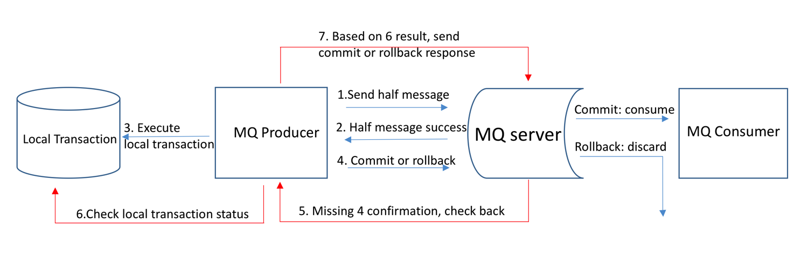
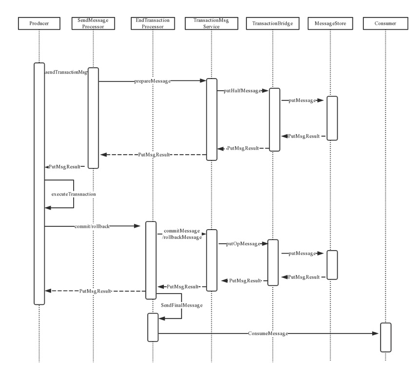
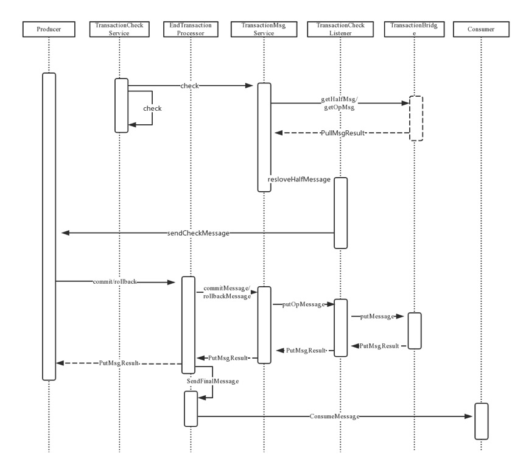

# spring-rocketmq-mysql-transaction-integration

spring boot
rocketmq
mysql
integration rocketmq , mysql and database transaction.

## rocketmq distributed trasactional message

* 1 Producer send half message to MQ server.
* 2 After send half message succeed, execute local transaction.
* 3 Send commit or rollback message to MQ Server based on local transaction results.
* 4 If commit/rollback message missed or producer pended during the execution of local transaction，MQ server will send check message to each producers in the same group to obtain transaction status.
* 5 Producer reply commit/rollback message based on local transaction status.
* 6 Committed message will be delivered to consumer but rolled back message will be discarded by MQ server.

Sending transactional message:

Checking transactional message:

We can get some introduce from [here](https://rocketmq.apache.org/rocketmq/the-design-of-transactional-message/)